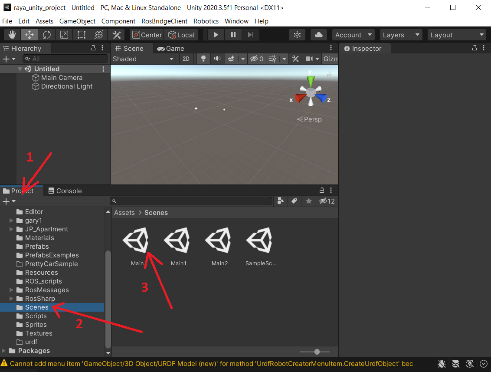
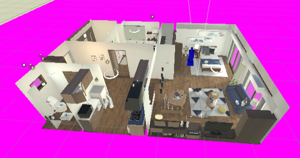
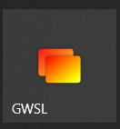
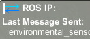

# Raya Unity Simulator - Windows 10 Setup

Tested with:
* Windows 10 21H1 Build 19043.1165

## 0. Clone Repository

Open a Windows Terminal (you can download it from Microsoft Store), and run:

``` bash
# Clone using HTTPs
mkdir -p ~/ur/
cd ~/ur/
git clone --recurse-submodules https://gitlab.com/unlimited-robotics/ros-workspaces/raya_unity_project.git
cd ~/ur/raya_unity_project
git checkout dds_bridge # remove when merge
```

``` bash
# Clone using SSH
mkdir -p ~/ur/
cd ~/ur/
git clone --recurse-submodules git@gitlab.com:unlimited-robotics/ros-workspaces/raya_unity_project.git
cd ~/ur/raya_unity_project
git checkout dds_bridge # remove when merge
```

## 1. Unity Project

Load the project (root folder of the repo) in Unity and select the "main" scene (double click).



Move to view to see both scene and robot (in blue):



Dont execute it yet.

## 2. WSL Image

Make sure you have the last Windows 10 Updates installes.

### 2.1. Enable WSL

Open a PowerShell as Administrator and run:

``` powershell
dism.exe /online /enable-feature /featurename:Microsoft-Windows-Subsystem-Linux /all /norestart
dism.exe /online /enable-feature /featurename:VirtualMachinePlatform /all /norestart
```

Restart your PC

Download the [Kernel Update](https://wslstorestorage.blob.core.windows.net/wslblob/wsl_update_x64.msi) and install it.

Run in an Administrator Powershell:

``` powershell
wsl --set-default-version 2
```

### 2.2. Download and Install Ra-Ya Distro

Remove old Ra-Ya WSL instance if it exists:

``` powershell
wsl --unregister raya
rm -r ~/ur/raya_wsl
```

Download the Ra-Ya WSL distro image from [here]().

Open a *PowerShell* terminal and execute:

``` powershell
cd <download_path>
mkdir -Force ~/ur/raya_wsl
wsl --import raya "$HOME/ur/raya_wsl" .\raya_<version>.tar.gz
```

### 2.3. Install WGSL and Enable GUI in Ra-Ya distro (only needed for slider controller, to me removed in the future)

Install *GWSL* from the *Microsoft Store*. [link](https://drive.google.com/file/d/1vJob2BApRoVvCDKi8s0MfTT49upRb2ie/view?usp=sharing).

Find it in the *Start Menu* and start it:



Click on *GWSL Distro Tools*, then on *Raya*, and enable *Display/Audio Auto-Exporting* and *LibGL Indirect*:


## 3. Execution

### 3.1. DDS Bridge

Launch the DDS bridge and ROS Workspace on WSL:

``` powershell
wsl -d raya /bin/bash -c /root/launch_connection.sh
```

You should see an output like:

``` 
...
ROS_MASTER_URI=http://localhost:11311
...
[INFO] [1629923077.453826]: Starting server on 172.24.0.206:10000
Unlimited Robotics - DDS-Robot Bridge
v0.2.0
...
(info) [20210825_152440] <RestfulService>: Service Initialized
UPDATE UNITY SIMULATOR WITH IP: 172.24.0.206
```

Make sure the shown IP is set in the Unity Simulator (Robotics -> ROS Settings -> ROS IP Address).

Start the Unity simulator (play button). You will see two blue and green arrows at the upper right corner of the simulation, they indicate the correct connection (red arrows would indicate wrong connection):



To finish the simuation, press Ctrl+C in the terminal and stop the Unity simulator by pressing the play button again.

### 3.2. Sliders controller (to be deleted in the future)

Open GWSL from the *Start Menu*.

Start the ROS Workspace and Slide controllers:

``` powershell
wsl -d raya /bin/bash -c /root/launch_controller.sh
```

You should see an output like:

```
...
ROS_MASTER_URI=http://localhost:11311
...
[INFO] [1629923307.274069]: Starting server on 172.24.13.148:10000
UPDATE UNITY SIMULATOR WITH IP: 172.24.13.148
``` 

Make sure the shown IP is set in the Unity Simulator (Robotics -> ROS Settings -> ROS IP Address).

Start the Unity simulator (play button). You will see two blue and green arrows at the upper right corner of the simulation, they indicate the correct connection (red arrows would indicate wrong connection):


To finish the simuation, press Ctrl+C in the terminal and stop the Unity simulator by pressing the play button again.
